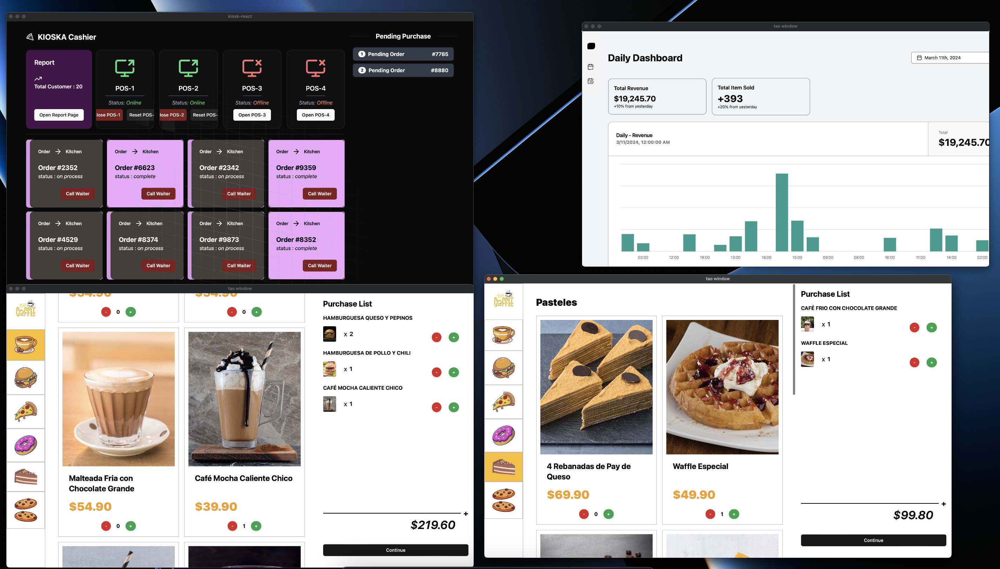
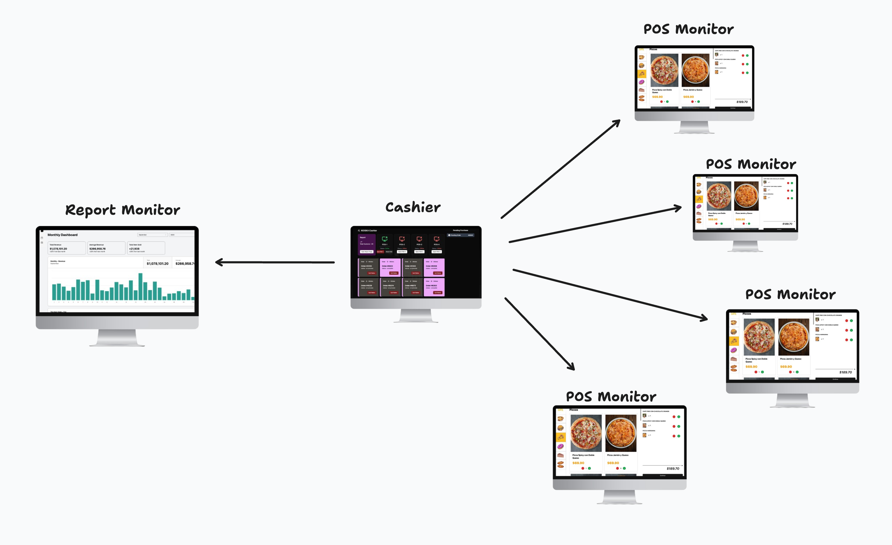
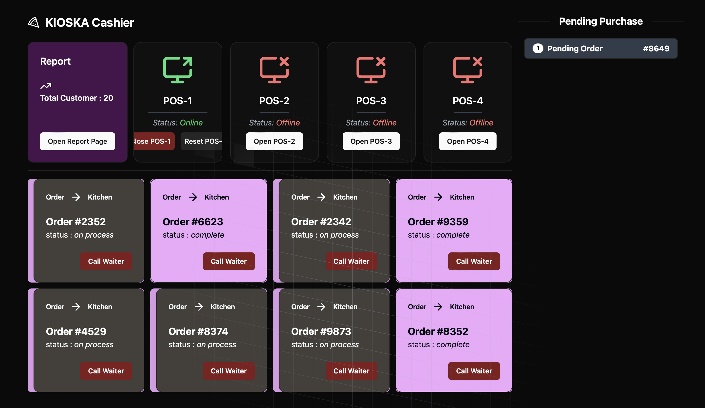
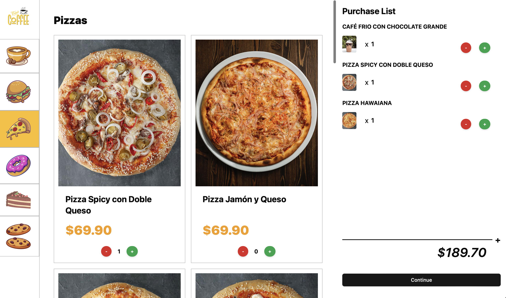
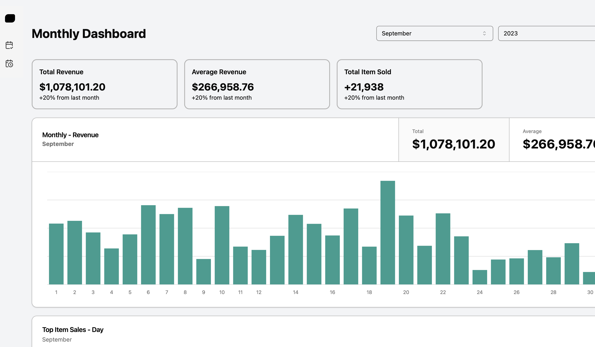

# **Kioska-POS: A Multi-Monitor Point of Sale Solution**

**Kioska-POS** is a cutting-edge point of sale (POS) application designed to streamline operations and enhance efficiency for businesses of all sizes. With its innovative multi-monitor support, Kioska-POS offers a flexible and scalable solution that can adapt to various business environments.

### **Core Features:**

- Empower your staff to handle multiple customers simultaneously with Kioska-POS's seamless multi-monitor support. This feature reduces wait times and improves overall customer satisfaction.
- **Increased Efficiency:** Streamline operations and reduce wait times with Kioska-POS's multi-monitor support.
- **Improved Accuracy:** Ensure accurate transactions and reporting with Kioska-POS's reliable features.
- **Enhanced Customer Experience:** Provide a faster and more efficient checkout process, leading to satisfied customers.
- **Data-Driven Decision Making:** Utilize sales reports to optimize inventory management, pricing strategies, and marketing efforts.

### Screen

Cashier Screeen

Point of Sales Screen

Report Screen
